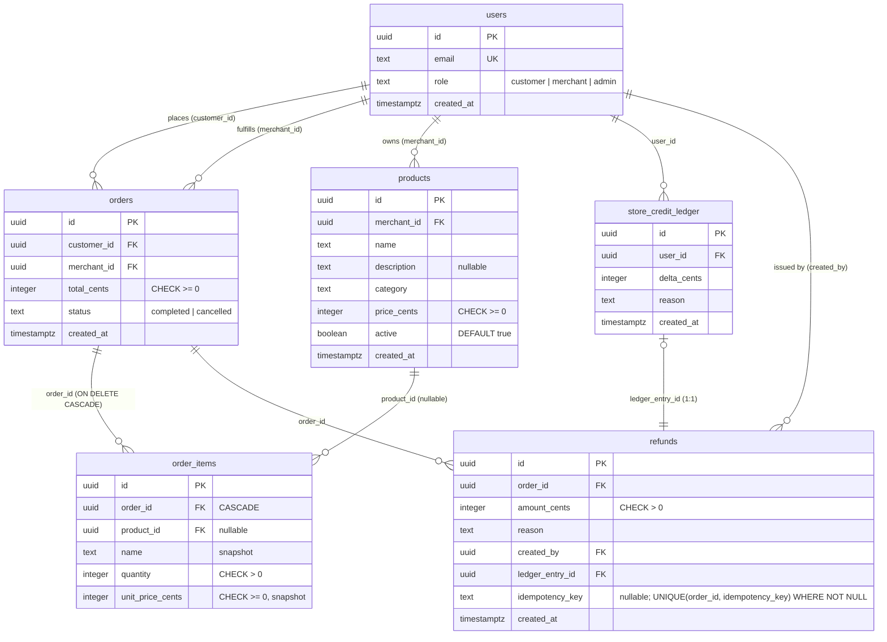

# Implementation Notes

This document summarizes the changes made on top of the base marketplace exercise: a **refunds**
feature, a **product catalog** (catalog-first foundation), supporting **API/UI** work, and a design
sketch for future features. It also records a local-dev gotcha worth knowing.

---

## Local development gotcha (Node version)

`tsx` (used to run the API and the DB scripts) hangs on **Node `v20.0.0`** — that release predates
the `module.register()` hook API (added in Node `20.6.0`) that `tsx` v4 relies on, so its loader
never starts and commands like `pnpm db:migrate` appear to "hang the system."

**Fix:** use a modern 20.x. The repo's `.nvmrc` says `20` (meant to resolve to the latest 20.x):

```bash
nvm use 20.19.5         # any >= 20.6.0 works
corepack enable && corepack prepare pnpm@10.28.2 --activate
nvm alias default 20.19.5   # optional, so new shells don't fall back to 20.0.0
```

Everything else follows the README quickstart.

---

## Feature 1 — Refunds

A merchant (or admin) can refund one of their orders; a refund issues **store credit** to the
customer as a positive `store_credit_ledger` entry. Because store credit is internal, the whole
operation is one ACID transaction — no external payment call. (`paymentProcessor.refundToCard` is
intentionally flaky and is **not** used by this path; it's only relevant to a future refund-to-card
extension.)

### Data model — `migrations/002_refunds.sql`

A first-class `refunds` table is the audit source of truth; it points at the ledger entry it
created.

| Column | Notes |
|---|---|
| `id` | PK |
| `order_id` | FK → `orders` |
| `amount_cents` | `CHECK > 0`, integer cents |
| `reason` | text |
| `created_by` | FK → `users` (the merchant/admin who issued it) |
| `ledger_entry_id` | FK → `store_credit_ledger` (the credit it created) |
| `idempotency_key` | nullable; partial `UNIQUE(order_id, idempotency_key)` so retries can't double-credit |
| `created_at` | timestamp |

### Code

- `apps/api/src/domain/refunds.ts` — **pure** money rules (`resolveRefundAmount`,
  `maxRefundableCents`): completed-only, positive integer cents, cumulative refunds may never
  exceed the order total, blank amount = full remaining.
- `apps/api/src/auth/policy.ts` — `canRefundOrder` (admin: any; merchant: own; customer: never).
- `apps/api/src/routes/refunds.ts`
  - `POST /orders/:id/refunds` — runs in a transaction with `SELECT ... FOR UPDATE` on the order so
    concurrent refunds can't both read the same "already refunded" total; writes the ledger entry
    **and** the refund row atomically. An optional `idempotency_key` makes retries safe (a replay,
    including a unique-index race, returns the original refund).
  - `GET /orders/:id/refunds` — refund history (viewable by anyone who can view the order).
- `apps/api/src/routes/storeCredit.ts` — `GET /me/store-credit` → `{ balance_cents }` =
  `SUM(delta_cents)`.

### Tests

`apps/api/src/__tests__/refunds.test.ts` — 12 pure unit tests (policy + amount math, boundaries,
over-refund, partial/full, non-completed), matching the shipped DB-free style.

---

## Feature 2 — Product catalog (catalog-first foundation)

The base schema had no products — line items were free text. A small catalog unlocks richer order
display and the future features below.

### Data model — `migrations/003_products.sql`

- `products(id, merchant_id → users, name, description, category, price_cents CHECK >= 0, active,
  created_at)` — merchant-owned catalog.
- `order_items` gains a **nullable** `product_id` FK → `products`. `name` and `unit_price_cents`
  remain the **at-purchase snapshot** (copied at order time, never mutated when a product later
  changes price or is retired). Legacy/free-text items keep working (`product_id` is null).

### Seed — `packages/db/seed/seed.ts`

Rewritten to seed a coherent world: 7 users, a 12-product catalog (2 intentionally `inactive`), 11
product-linked orders (one cancelled), and a real partial refund — driven by handle→id maps and an
`item(handle, qty)` helper that snapshots the catalog price.

### Order API now returns product details

`GET /orders` and `GET /orders/:id` include each order's `items[]` (snapshot `name`, `quantity`,
`unit_price_cents` + catalog `category` and `product_active`), fetched in **one batched query**
(`WHERE order_id = ANY($1::uuid[])`) to avoid N+1. Each order also carries derived `refunded_cents`.

---

## UI changes (`apps/web`)

- **Role-aware shell** (`App.tsx`): decodes the JWT role (UI gating only); shows store-credit
  balance to customers and refund actions to merchants/admins; holds the list ↔ detail selection.
- **Store credit** (`components/StoreCredit.tsx`): customer balance via `GET /me/store-credit`.
- **Orders list** (`screens/OrdersList.tsx`): a clean summary (Order · Status · Total · Refunded ·
  **View**). Status is **derived** (`completed` → `partially refunded` → `refunded`).
- **Order detail** (`screens/OrderDetail.tsx`): line items with product details and subtotals,
  totals (total/refunded/remaining), refund history, and a refund control (blank = full remaining)
  that disables once nothing remains.
- Shared helpers in `lib/orders.ts` (`refundedCents`, `remainingCents`, `displayStatus`).

---

## ER diagram (current schema)



---

## Testing & verification

- `pnpm typecheck` — clean across `@app/api`, `@app/db`, `@app/web`.
- `pnpm test` — 29 passing (26 API incl. the 12 refund tests, 3 web).
- `pnpm --filter @app/web build` — bundles successfully.
- Migrations + seed verified against a live Postgres; refund↔ledger linkage checked (every refund
  maps 1:1 to a ledger entry with matching amount/customer; no over-refunds).

---

## Design decisions & trade-offs

- **Derive, don't duplicate.** Refunded totals and order "status" (partially/fully refunded) are
  derived from the `refunds` table rather than stored on `orders`, to avoid drift. A persisted
  status column is an easy follow-up (relax the `orders.status` CHECK, update inside the refund
  transaction) if a consumer needs it.
- **Snapshots on line items.** Orders preserve the price/name paid even if the product later
  changes — history must not move.
- **Idempotency via DB constraints**, not the payment provider's id (which is non-deterministic).

---

## Future features (designed, not built)

Both need the catalog (now in place) and reuse the `orders` table as the verified-purchase signal.

1. **Reviews** — `merchant_reviews` / `product_reviews` (`rating CHECK 1..5`, FK to the proving
   `order_id`, `UNIQUE(customer, target)`); server-side verified-purchase + per-row ownership;
   aggregates computed on read first.
2. **Personalization** — start rule-based over existing data: "buy again" + category affinity,
   ranked by popularity and review rating; later co-purchase ("customers who bought X also bought
   Y") via a precomputed affinity table. Cancelled orders / inactive products excluded; cold-start
   falls back to globally popular.

Suggested order: catalog (done) → reviews → personalization (reuses ratings as a ranking signal).
